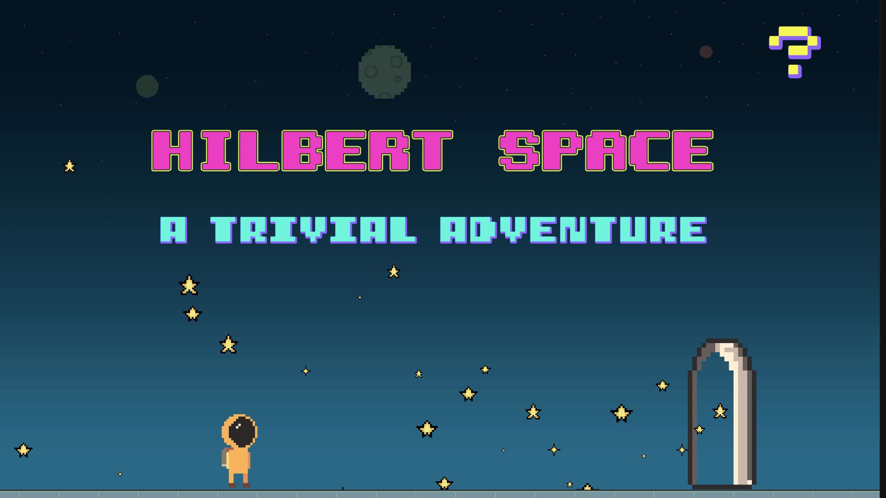
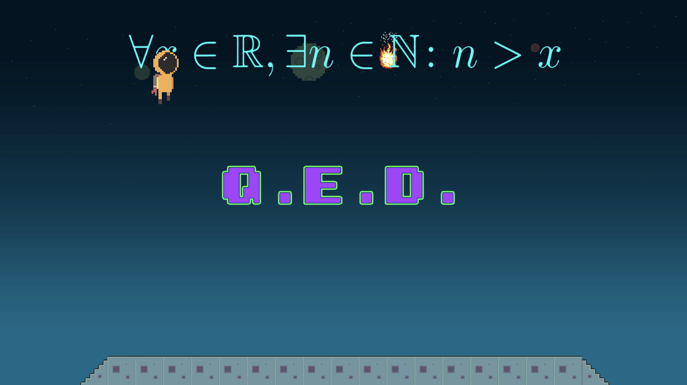
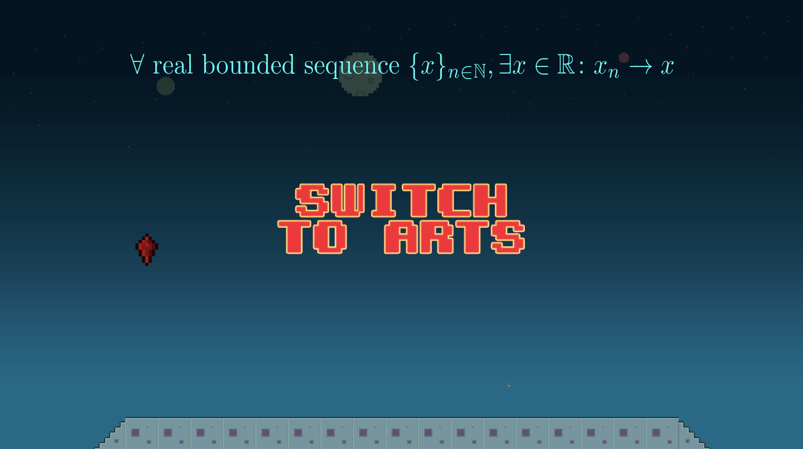

# Hilbert Space
[Hilbert space](https://sharemygame.com/@MariaSolOs/hilbert-space?fbclid=IwAR2Gef9ftxYe6PrWNHtGzr1gYAlrcx66-7OOcRjSZYSDp0nDn_EXZoM26K0) is a simple mathematical video game: Given a theorem from real analysis, collect the classifiers ("for all" and "there exists") in the correct order.

## How to play
Use the left and right arrows to move and collect the mathematical symbols in the correct order. 3 mistakes and you lose the game.

## Built with
* [Unity Engine](https://unity.com/)
* Space sprites from [Aiden Art](https://jerrofficial.wixsite.com/aidenart). All animations were originally created. 
* `C#` as the scripting language.
* Lots of ❤️.

## Author
* [Maria Solano](https://mariasolos.github.io/me/) 

## License
[MIT licence](https://opensource.org/licenses/MIT)